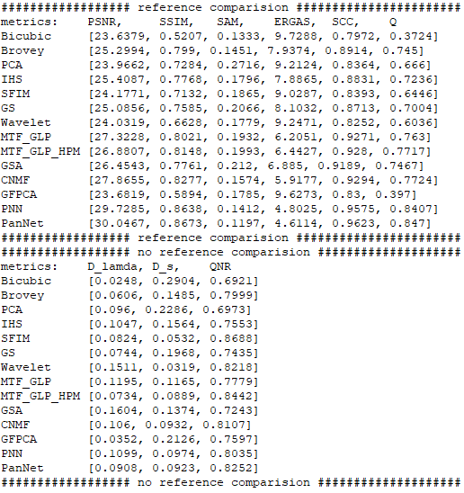

# Py_pansharpening
A Python version pansharpening toolbox with some classic methods. The toolbox implements the following algorithms so far,
- Brovey 
- PCA
- IHS
- SFIM
- GS
- Wavelet
- MTF-GLP
- MTF-GLP-HPM
- GSA
- CNMF
- GFPCA
- PNN
- PanNet

**Demo for Pansharpening**
```
python demo_pansharpening.py
```
 
**Demo for Evaluating Above Methods**
```
python demo_all_methods.py
```

**Evaluation example**



**Requirements**
```
tensorflow-gpu==1.8.0
keras==2.2.4
numpy==1.14.2
cv2==4.1.0
scipy==1.2.1
scikit-learn==0.21.2
pywt==1.0.3
```